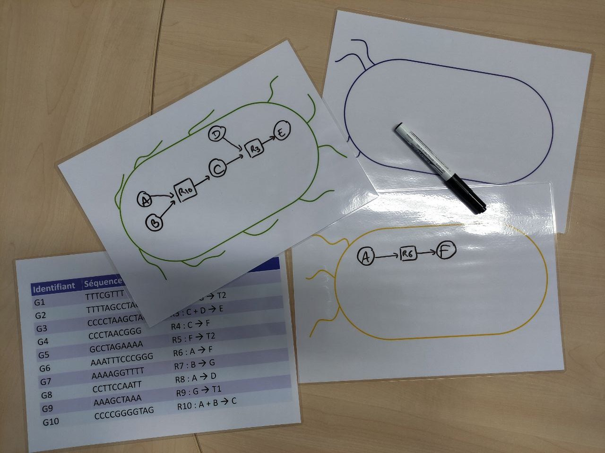

# Outreach activity on Metagenomics and Metabolic modelling

This science outreach workshop was designed for the [MIMM project](https://www.labri.fr/en/actualites/mimm-moi-informaticienne-moi-mathematicienne), a free one-week internship hosted at the University of Bordeaux during which young girls in 9th and 10th grade are taught mathematics and computer science by female researchers, teachers or students. This workshop was designed as a 5 hour activity, roughly 2.5 on metagenomics and 2.5 on metabolic modelling.

It is a combination of CS unplugged resources and relatively simple algorithms to teach the role of computer science in understanding the role of bacteria within ecosystems.

The purpose of the activity is to introduce two fundamentals of computational biology:

- sequence algorithms
- modelling and systems biology.

Regarding computer science, I aim at introducing the following notions:

- graphs/networks as useful objects that can be used for several applications depending on what data we include in them (assembly graph, metabolic network)
- knowledge representation and reasoning that can be used in modelling to represent our data and express logic rules to answer a given question.


## Biological context

The activity leader should start the activity by explaining the context, for example as below.

Microbial communities are everywhere. Just like any other ecosystem, they live in specific environments, constitute a diversity of species, and interact among them. Such ecosystems exist in the soil, at the root of plants, in the ocean, or even in our guts. However, contrary to other ecosystems, we cannot just simply observe them to build hypotheses on how they work. At least not with eyes.

The solution is to decode their DNA, their genetic sequences. DNA is a long sequence of nucleotides, let's say 4 million of those for a bacterium, generally represented by four letters, A, T, C and G. The sequence, also described as a genome, contains pieces called genes. The genome can be seen as a recipe book that holds, among other things, these genes which are recipes for the cell to manufacture a machinery that can transform molecules into others. These biochemical reactions constitute the metabolism.

Using bioinformatics and databases, we are able to predict what molecule transformations - biochemical reactions - are likely to occur in a microbial cell starting from its DNA sequence. By doing so, we can hopefully answer some additional questions, such as identifying the species responsible for the production of an important molecule, a vitamin that we need to be healthy for instance. We will try to do so in this workshop.

Back to our microbial ecosystem, all we need is the DNA sequence of the microbes then. Machines called sequencers aim at providing us with the sequences, starting from the DNA of the microbes. Unfortunately, they do not provide us with the complete sequence of 4 millions letters as a whole, but rather with pieces of them, called reads, which are often of length 150, more and more often a few thousand nucleotides. Hence we have a puzzle to be solved as we need to reconstruct the whole 4-million word with mini-words of 150 letters or so. We can do so because each letter of the complete word is sequenced several times, thus occurs in several reads. By overlapping the reads, we can build larger words until hopefully we reconstruct everything. This is _genome assembly_.

In reality, we have several co-occurring genomes sequenced together, so rather than solving a puzzle, we have a puzzle of a hundred puzzles to be assembled. In addition, there can be errors during sequencing, impeding the overlap between reads to be perfect. In this workshop, we work with sequences that are simple, we start the assembly with individual genomes, and only later we test our algorithm on the mixture of genomes, called the _metagenome_.


## Unplugged CS resources

The powerpoint file contains everything that needs to be printed for the activity.
attendees are expected to work in groups of 3-4. The activity leader will let them work alone at first, come visit the group, before a review of the thoughts with the whole group. Then the computer part can start, with very small pieces of Python as an example, and the design of the algorithm

The unplugged resourced by group are the following

- metagenomic activity
    - the reads of all three genomes. Each read has one side with the sequence in the corresponding colour of the bacterium (yellow, blue, green), and the other side in black to make the assembly harder, but also more realistic, by considering the whole metagenome. The powerpoint has the reads, they need to be cut after printing (fun part).
- metabolic modelling activity
    - the genome of each bacterium (3 in total). I laminate the sheets after printing so that attendees can write on them with erasable markers when they find metabolic-associated genes.
    - A database of metabolic-associated genes and their corresponding metabolic reactions. I also laminate this sheet. 
    - Empty drawings of the three bacteria where attendees will draw the metabolic networks once they retrieve the genes in the genome with the help of the database. I also laminate these for erasable drawings.

### Metagenomic part

For this part, one needs to print and cut the reads so that attendees can try to assemble them and get the idea of using prefixes and suffixes to assemble.

The picture below illustrates the unplugged process of genome assembly using the material provided.


It is also the opportunity to introduce the notion of graph, that will be used throughout the activity.
In here, nodes will be the reads, and we will connect the reads if they overlap with each other.

### Metabolic modelling

Here, attendees will have access to the reconstructed genomes (each has a slide in the powerpoint) and will look for specific sequences within the genomes.

To do so, they'll have a database that connects genetic sequences to metabolic reactions.
If a genome holds one of such sequences, then we can assume the corresponding bacterium has the ability to execute the matching reaction.

Alignment of sequences will be carried out by the attendees as in the picture below.
There is a misalignment for one of the genes on a bacterial genome. Originally this is typo but it actually can be quite nice to talk about reality with misalignments that can occur because of mutations. 


Once a sequence is found, the corresponding metabolic reactions can be added to the metabolic network of the bacterium, as in the picture below. 



In the powerpoint, there are two slides with the sequences to be matched, which can be printed on transparent plastic sheets to ease the search.

After the reconstruction, the attendees can draw their networks on a white board and we can take some time to discuss their characteristics: some compounds cannot be produced, they have to be found in the environment. Some compounds are needed by all bacteria, this could lead to competition. On the other hand, some compounds are produced by a species and can be consumed by others: this could be cooperation. Say that these are interactions we would like to capture. Define a metabolic model as the combination of a metabolic network, the environment composition, and a mathematical representation of producibility. Attendees understand rapidly that the whole set of reactants of a reaction must mbe available for the product to become available too. This is what we will model on the computer. 

## Computing part

### (Meta)genome assembly

For young attendees with no or few experience with programming, it is best to spend most of the computing part on general Python notions. Let them create a create as a string, teach them how to get prefixes and suffixes of this read, store them in variables, test the equality of the suffix of a read and the prefix of a second. They easily understand that a length of the prefix/suffix is important, and that the smaller the prefix/suffix, the less likely two reads can be assembled, it can be a random alignment. So I find useful to tech them `for` loops by iterating on the prefix/suffix length for a pair of reads and testing the equality at each iteration. 

Then when these basic concepts are understood, we can talk about how we would proceed in practice, how would we build the algorithm. I usually finish by showing them the results of a "real" implementation of assembly. 

A notebook is available with two approaches for assembly. I suggest working with the second where we build an overlap graph by considering suffixes of reads which are prefixes of others. We calculate all the overlaps, then we simplify the graph by only keeping for each node (read), the association to the read it has the strongest overlap with. By doing so, we end up with a new graph that gives us the order in which we need to assemble the reads to reach the full sequence.

In practice, this assembly method is not the one that is used for real data.
If interested, one can take a look at De Bruijn graphs which are routinely used.

In reality, genomes of bacteria are circular.

### Metabolic modelling

The reconstruction of metabolic networks for the three bacteria is done in a unplugged way by looking for specific sequences within their genomes.

A good first step on the computer is to let the attendees visualise real size metabolic networks. [Fluxer](https://fluxer.umbc.edu/) does very well the job. Click on "complete graph" and use the "Force" layout to see the whole graph. Recon3D is the human metabolic network, but also the largest: really gives a motivation on using computers to explore the metabolism rather than doing it manually.

Then starts the modelling part: how to model what a bacterium is capable of doing in an environment?
I use Answer Set Programming, a logic paradigm that is great for knowledge representation and reasoning as it is very expressive. It ca be used [online](https://potassco.org/clingo/run/)
A first example to understand ASP is the following: 

```
sparrow("Jack"). % knowledge
penguin("Mary"). % knowledge

bird(X) :- sparrow(X). % rule

flies(X) :- bird(X), not penguin(X). % rule

#show flies/1.
```

The metabolic networks are described as knowledge, as well as the environment composition. Let the attendees write the network contents as in `metabolism/metabolism_toys.lp`. Use a shared notepad for splitting the modelling between attendees.

Now let the attendees model the producibility of compounds in a given environment.

```
available(X, B) :- environment(X), bacterium(B).
available(X, B) :- product(X,R), reaction(R,B), bacterium(B), producible(Y,B):reactant(Y,R). 
```

Illustrate what can be done on a more complex model as in `metabolisù/bact_selection.lp` where we select minimal-size communities and represent metabolic exchanges.
The Clingo solver (easily installed in a Python environment using conda or pip) can be called to solve the problem of selecting a minimal-size community of bacteria able to ensure the producibility of two metabolites: `T1` and `T2`.

## License

[CC-BY-NC-SA](https://creativecommons.org/licenses/by-nc-sa/2.0/)
